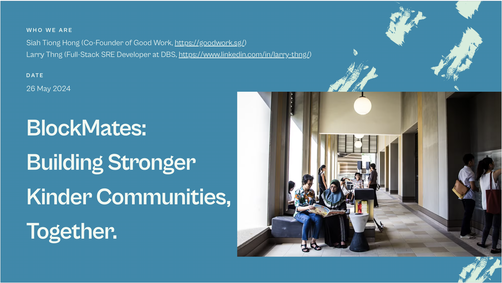
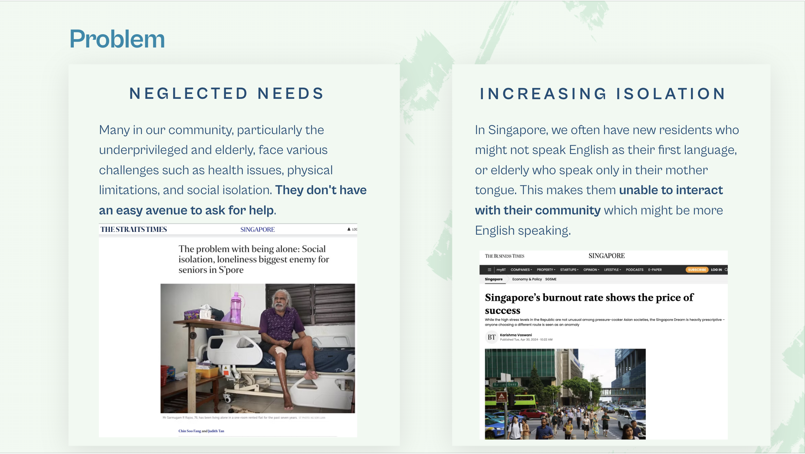
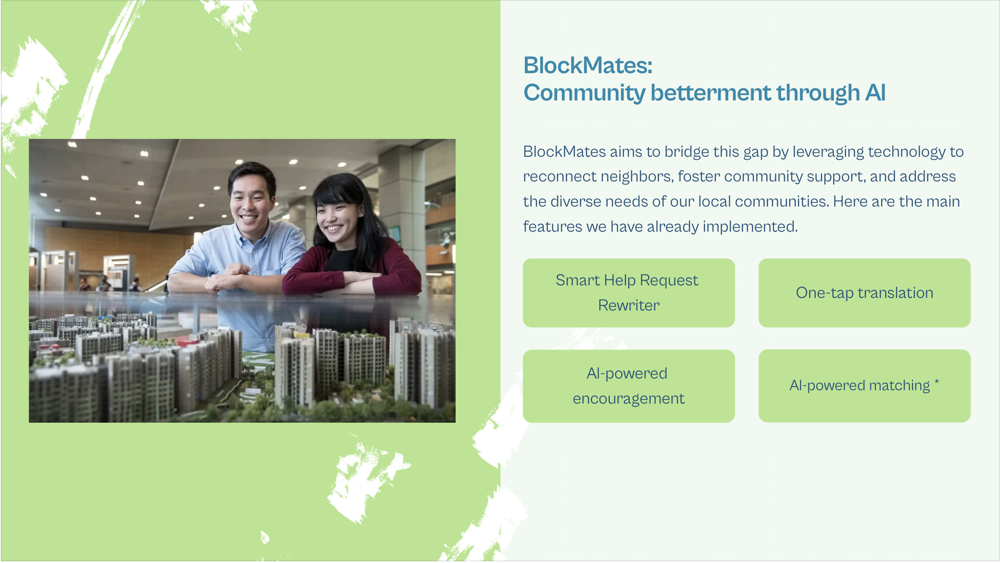
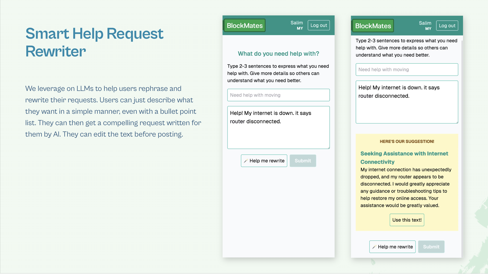
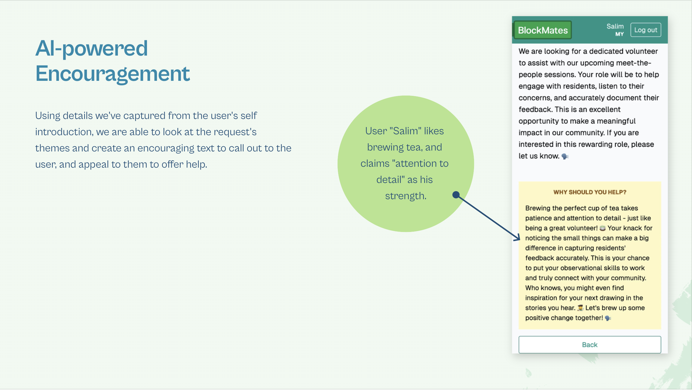
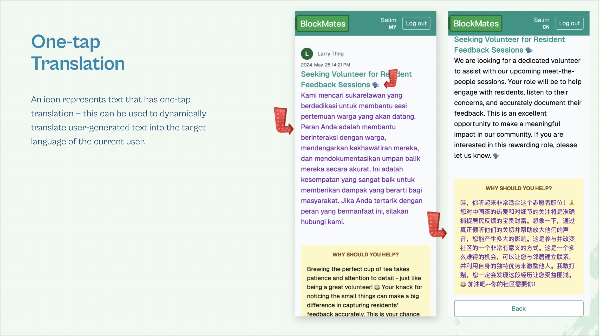
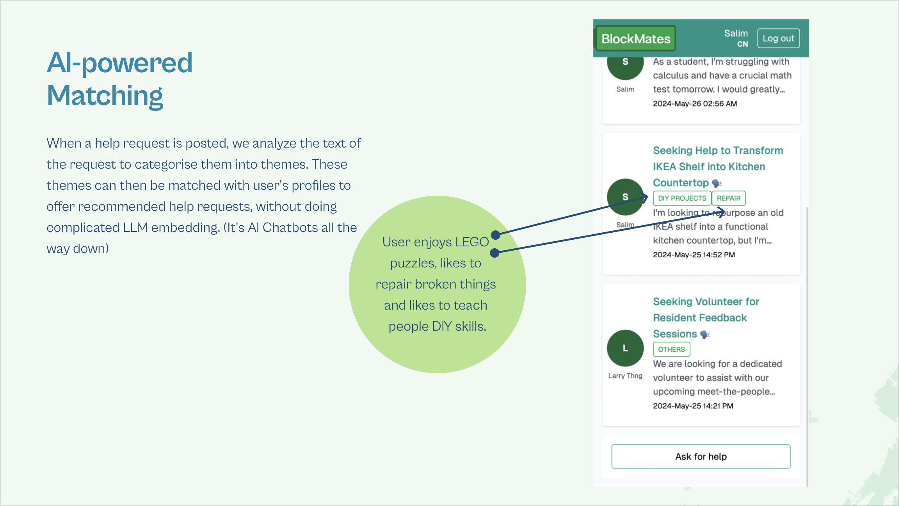
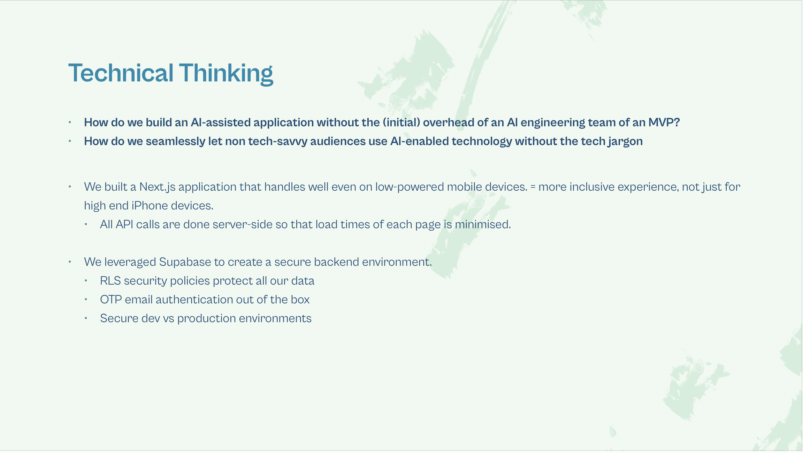

> [!NOTE]  
> Blockmates was created as a hackathon project during [hacksingapore 2024](https://angelhack.com/hackglobal/singapore/) by @screesaversclub and @larrythng96
> Watch the video demo below:
>
> https://github.com/screensaversclub/blockmates/assets/67162738/dfe34968-64cd-4202-bcf3-f5d9cbd9d2b7

# BlockMates

BlockMates is a neighborhood social app designed to foster community support and connection among neighbors. Leveraging the power of AI and modern technologies, BlockMates aims to facilitate meaningful interactions, promote acts of kindness, and build stronger, more connected communities.

<table>
  <tr>
    <td></td>
    <td></td>
  </tr>
  <tr>
    <td></td>
    <td></td>
  </tr>
  <tr>
    <td></td>
    <td></td>
  </tr>
  <tr>
    <td></td>
    <td></td>
  </tr>
</table>

## Features

- AI-Powered Matching: Matches neighbors who need help with those who can provide it, using AI-powered inference of user's profiles and strengths.
- - One-tap Translation: User-submitted text can be translated with one tap anywhere in the app, making the app inclusive to non-English speakers.
- AI-Driven Motivation: Encourages engagement for community members to offer help - using personalised text prompts.
- Smart Help Requests: Assists users in crafting compelling help requests, increasing the likelihood of receiving timely assistance.

## To run BlockMates locally, follow these steps:

```bash
# Clone the repository:
git clone https://github.com/screensaversclub/blockmates.git
cd blockmates
npm install

# Set up Supabase:
# Sign up for a free account on Supabase.

# Create a new project and obtain your Supabase URL and API Key. You'll also need an Anthropic and DeepL API Key.
# Add the following API keys to .env.local
NEXT_PUBLIC_SUPABASE_URL=xxx
NEXT_PUBLIC_SUPABASE_ANON_KEY=xxx
ANTHROPIC_API_KEY=xxx
DEEPL_API_KEY=xxx

# Initiate supabase with the migrations found in supabase/migrations
# https://supabase.com/docs/reference/cli/supabase-db-push


# Start the development server:
npm run dev
# Open http://localhost:3000 in your browser to view the app.
```

We welcome contributions from the community! Fork and PR, submit issues (requests), we await your contribution.
